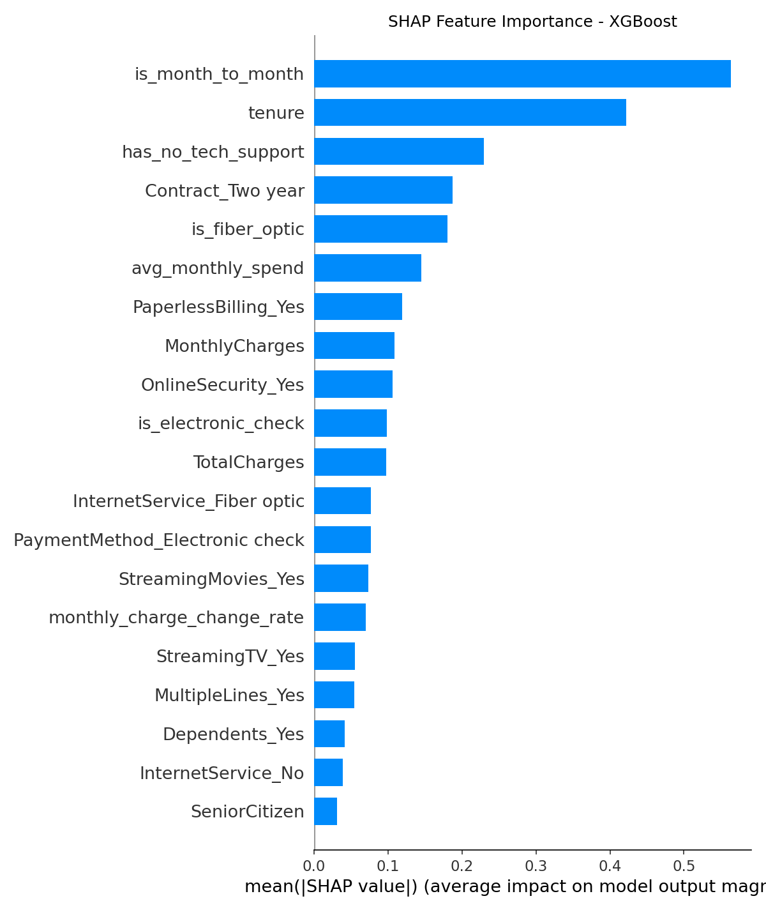
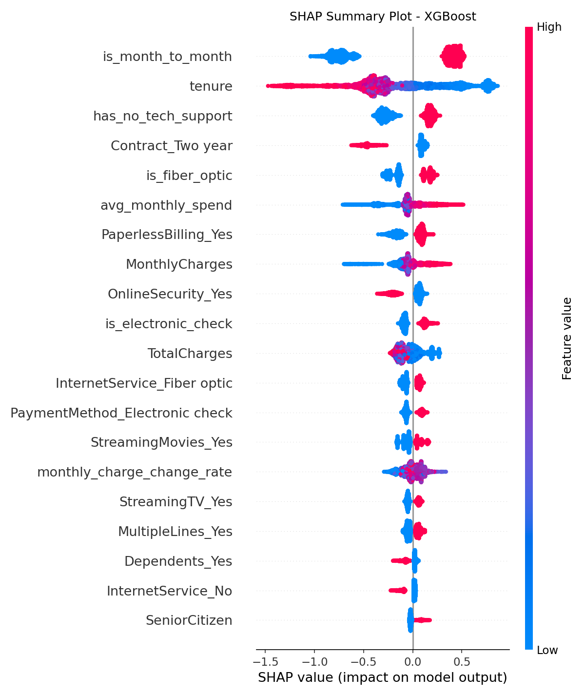

# Telekom Müşteri Kaybı (Churn) Tahmin Modeli

Bir telekom operatörünün müşteri kaybını (churn) önceden tahmin eden uçtan uca bir makine öğrenmesi projesi. Veri ön işleme, öznitelik mühendisliği, çoklu model karşılaştırması, SHAP tabanlı yorumlanabilirlik analizi, FastAPI ile deploy ve Streamlit demo arayüzünü kapsar.

## Veri Seti

| | |
|---|---|
| **Kaynak** | [Telco Customer Churn (Kaggle)](https://www.kaggle.com/datasets/blastchar/telco-customer-churn) |
| **Boyut** | 7.043 müşteri × 21 değişken |
| **Hedef değişken** | `Churn` (Yes / No), pozitif sınıf oranı ~%26.5 |
| **Değişken grupları** | Demografik bilgiler · Abonelik/sözleşme · Aldığı servisler · Ücretlendirme |


### Feature Engineering

| Yeni Değişken | Amaç |
|---|---|
| `tenure_group` | tenure'ü 5 anlamlı aralığa bölme (0-6 ay, 6-12 ay, 1-2 yıl, 2-4 yıl, 4-6 yıl) — doğrusal olmayan eşik etkisinin yakalanması |
| `avg_monthly_spend`, `monthly_charge_change_rate` | Fatura trendinin / mevcut ücretin geçmiş ortalamadan sapmasının yakalanması |
| `total_services` | Müşterinin aldığı ek servis sayısı — bağlılık derecesinin tek metrikte özetlenmesi |
| `is_month_to_month`, `is_fiber_optic`, `has_no_tech_support`, `is_electronic_check` | EDA'da tespit edilen yüksek riskli segmentlerin işaretlenmesi (risk flag'leri) |

### Model Eğitimi

Dört model, artan karmaşıklık sırasıyla eğitilip 5-fold (RF için 3-fold) cross-validation ile karşılaştırılmıştır:

1. **Logistic Regression** 
2. **Logistic Regression + SMOTE**
3. **Random Forest** 
4. **XGBoost** 

Model seçiminde ana kriter, sınıf dengesizliğinden en az etkilenen metrik olan **ROC-AUC** olmuştur.

**Threshold optimizasyonu:** Varsayılan 0.5 yerine, validation setinde F1'i maksimize eden threshold seçildi — çünkü kaçırılan bir churn müşterisinin maliyeti, yanlışlıkla "riskli" işaretlenen sadık bir müşteriye kampanya göndermekten çok daha yüksek.

### SHAP Analizi





## Sonuçlar

| Model | Accuracy | Precision | Recall | F1 | ROC-AUC |
|---|---|---|---|---|---|
| **XGBoost** ⭐ | 0.744 | 0.511 | 0.794 | 0.622 | **0.846** |
| Logistic Regression | 0.741 | 0.508 | 0.797 | 0.620 | 0.845 |
| Random Forest | 0.767 | 0.543 | 0.762 | 0.634 | 0.844 |
| Logistic Regression + SMOTE | 0.741 | 0.508 | 0.797 | 0.620 | 0.843 |

**Seçilen model: XGBoost** — en yüksek ROC-AUC ve yüksek recall (churn eden müşterilerin ~%79'unu yakalar), production ortamında hiperparametre ayarına daha esnek.

## Önemli Bulgular

- Churn oranı **%26.5** → dengesiz veri seti (imbalanced), doğrudan accuracy yanıltıcı olur
- **Month-to-month** kontrata sahip müşterilerde churn oranı, 2 yıllık kontrata göre **~5 kat** daha yüksek
- **Fiber optic** internet servisi olanlar, DSL kullananlara göre daha yüksek churn eğiliminde
- `TechSupport` ve `OnlineSecurity` almayan müşterilerde churn belirgin şekilde artıyor
- İlk 12 ay içindeki müşteriler en riskli segment

SHAP analizine göre churn'ü en çok etkileyen 10 değişken:

| Sıra | Feature | Mean \|SHAP\| |
|---|---|---|
| 1 | `is_month_to_month` | 0.563 |
| 2 | `tenure` | 0.422 |
| 3 | `has_no_tech_support` | 0.230 |
| 4 | `Contract_Two year` | 0.188 |
| 5 | `is_fiber_optic` | 0.180 |
| 6 | `avg_monthly_spend` | 0.145 |
| 7 | `PaperlessBilling_Yes` | 0.119 |
| 8 | `MonthlyCharges` | 0.109 |
| 9 | `OnlineSecurity_Yes` | 0.106 |
| 10 | `is_electronic_check` | 0.098 |

En etkili faktör **sözleşme tipi** (ay-ay sözleşme), ikinci en güçlü sinyal ise **müşteri kıdemi (tenure)**'dir. Bu iki bulgu, retention stratejisinin odak noktasını belirlemektedir.

## Business Impact Analizi

- Ortalama aylık gelir/müşteri: `MonthlyCharges` ortalaması (~$64)
- Retention kampanyasının başarı oranı: %30 (endüstri ortalaması, kampanya alan riskli müşterinin churn'den vazgeçme ihtimali)
- Kampanya maliyeti/müşteri: ~$20

## Churn Engellenebilmesi için Öneriler

- 🎯 **Sözleşme yükseltme kampanyaları** (en yüksek öncelik) — ay-ay sözleşmeli müşterilere 1-2 yıllık sözleşmeye geçiş teşvikleri
- 👋 **Güçlü onboarding süreci** — ilk 90 günde proaktif destek ve otomatik risk skorlaması
- 🛡️ **Teknik destek / online güvenlik teşviki** — ücretsiz deneme süreleri
- 📡 **Fiber optic segment analizi** — NPS ölçümü ve kök neden araştırması
- 💳 **Otomatik ödemeye geçiş teşviki**
- 🔄 **Modelin CRM'e entegrasyonu** — aylık risk skorlaması ve otomatik yönlendirme
- 📊 **Model drift takibi** — 3-6 ayda bir yeniden eğitim


## Kurulum

```bash
git clone 
cd telco-churn-prediction
python -m venv venv
source venv/bin/activate      
pip install -r requirements.txt
```


## Projeyi kullanma 

```bash
# 1) Veriyi data/ klasörüne koy (Kaggle'dan indir)
#    -> data/WA_Fn-UseC_-Telco-Customer-Churn.csv

# 3) Öznitelik mühendisliği
python src/feature_engineering.py

# 4) Model eğitimi ve karşılaştırma (LR, LR+SMOTE, RF, XGBoost)
python src/train.py

# 5) SHAP analizi ve görselleştirmeler
python src/shap_analysis.py

# 6) API'yi ayağa kaldır (proje kökünden)
uvicorn api.main:app --reload --port 8000
# -> Swagger UI: http://localhost:8000/docs

# 7) Streamlit arayüzünü aç (yeni bir terminalde)
streamlit rstreamlit_app./app.py
```

